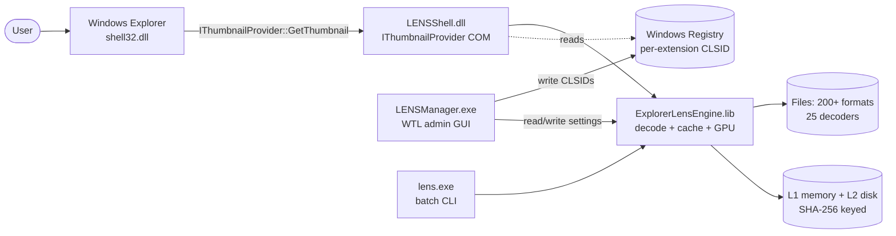
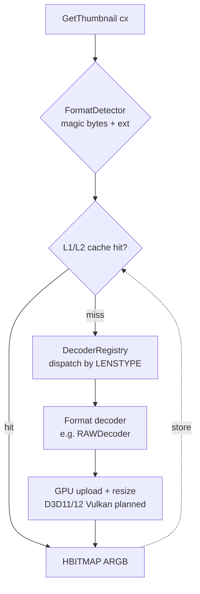
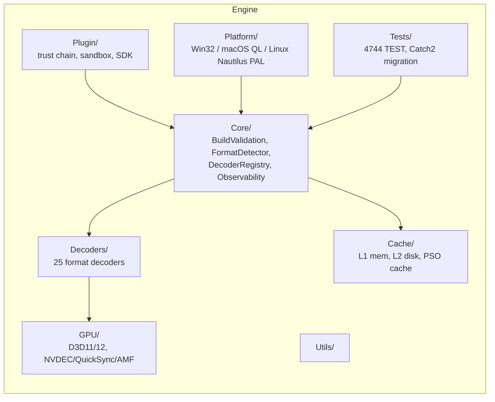
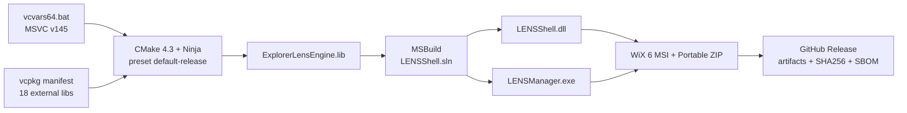

# ExplorerLens — Architecture

> Root-level architecture summary. Detailed diagrams (SVG + Mermaid) live in
> [`docs/architecture/`](docs/architecture/README.md).
> Strategic direction lives in [`ROADMAP.md`](ROADMAP.md).

**Version:** 39.9.0 "Betelgeuse" · **Language:** C++20 (MSVC v145) · **Primary artifact:** `LENSShell.dll` (Windows Shell Extension, COM `IThumbnailProvider`)

---

## 1. System context

## 2. Binary layout

| Artifact | Size | Role |
|---|---|---|
| `LENSShell.dll` | ~2940 KB | Shell extension (COM in-process DLL, CLSID `9E6ECB90-5A61-42BD-B851-D3297D9C7F39`) |
| `LENSManager.exe` | ~400 KB | WTL admin GUI (registration, settings, diagnostics) |
| `lens.exe` | ~250 KB | Batch CLI, scriptable thumbnail extraction |
| `ExplorerLensEngine.lib` | — | Static library linked by all three front-ends |
| `plugins/*.dll` | varies | Third-party decoders via the C-ABI Plugin SDK |

## 3. Decode pipeline

- **Cache hit target:** < 5 ms
- **Single-thumbnail decode target:** 17 ms average
- **Batch target:** 235 img/sec

## 4. Engine subsystems (Engine/**)

> The v4.0 roadmap consolidates 16 sub-directories to 7 (`Core`, `Decoders`, `GPU`, `Cache`, `Platform`, `Tests`, `Utils`). See ROADMAP §7.2.

## 5. Build graph

- **Build driver:** `build-scripts/Build-MSVC.ps1` (sources vcvars64 automatically)
- **Test driver:** `ctest --test-dir build -C Release --output-on-failure`
- **Version driver:** `build-scripts/Bump-Version.ps1` (updates 21 version-bearing files atomically)

## 6. CI topology

22 workflows under `.github/workflows/`:

| Category | Workflows |
|---|---|
| Build & test | `build.yml`, `ci-matrix.yml`, `reusable-build.yml`, `catch2-tests.yml`, `toolchain-verify.yml` |
| Quality | `code-quality.yml`, `codeql.yml`, `coverage.yml`, `pr-checks.yml` |
| Performance & visual | `performance-regression-gate.yml`, `screenshot-regression.yml`, `binary-size.yml` |
| Corpus & docs | `corpus-validation.yml`, `docs-validation.yml`, `pages.yml` |
| Release | `release.yml`, `release-drafter.yml`, `publish-packages.yml` |
| Hygiene | `auto-label.yml`, `sync-labels.yml`, `stale.yml`, `notify-failure.yml` |

## 7. Detailed diagrams

See [`docs/architecture/README.md`](docs/architecture/README.md) for the full set, including:

- System components (SVG + Mermaid)
- Decode pipeline (5-stage)
- Plugin architecture (trust + sandbox)
- CI/CD pipeline
- Test architecture
- Release flow
- Format matrix (200+ ext × decoder family)
- Cache architecture (L1/L2)
- Plugin lifecycle
- GPU pipeline

## 8. Key invariants

- COM CLSID `9E6ECB90-5A61-42BD-B851-D3297D9C7F39` is **immutable**
- `LENSTYPE` enum values must never collide — grep before adding
- Zero warnings, zero suppressions (`/WX`, no `/wdXXXX`)
- Every `extern void Runner()` in `EngineTestsExterns.h` must have a matching `RUN_TEST()` in `EngineTests.cpp`
- Version string appears in 20 files — never edit by hand; always use `Bump-Version.ps1`
