# ExplorerLens.io — High-Performance Thumbnail Generator

<p align="center">
  
</p>

## Windows Shell extension for 200+ file formats

ExplorerLens.io generates thumbnails for images, videos, documents, 3D models, fonts, archives, and more using
**multi-threaded processing** with GPU acceleration planned for Phase 2. The project root directory is
`ExplorerLens.io`, and this repository is the production codebase for the Explorer extension, engine, and manager UI.

[](https://github.com/RajwanYair/ExplorerLens.io/actions/workflows/build.yml)
[](https://github.com/RajwanYair/ExplorerLens.io/actions/workflows/ci-matrix.yml)
[](https://github.com/RajwanYair/ExplorerLens.io/actions/workflows/code-quality.yml)
[](https://github.com/RajwanYair/ExplorerLens.io/actions/workflows/codeql.yml)
[](https://github.com/RajwanYair/ExplorerLens.io/actions/workflows/coverage.yml)
[](https://github.com/RajwanYair/ExplorerLens.io/actions/workflows/performance-regression-gate.yml)
[](https://github.com/RajwanYair/ExplorerLens.io/actions/workflows/docs-validation.yml)
[](https://github.com/RajwanYair/ExplorerLens.io/releases/latest)
[](https://github.com/RajwanYair/ExplorerLens.io/releases)


| | |
| --- | --- |
| **Type** | Windows Shell Extension (`IThumbnailProvider` COM in-process DLL) |
| **GPU** | CPU decode with GDI+ fallback · DirectX 11 GPU acceleration planned (Phase 2) |
| **Platform** | **Windows 10 1809+ / Windows 11 (x64)** · macOS/Linux: planned Phase 5 |
| **Formats** | 200+ extensions — HEIC, AVIF, JXL, WebP, RAW, PDF, CBZ, CBR, EPUB, glTF, DDS, EXR, MP4, MP3, TTF … |
| **Cameras** | 100+ RAW formats — Canon (CR2/CR3), Nikon (NEF), Sony (ARW), Fujifilm, Adobe DNG, Olympus, Hasselblad … |
| **Language** | C++23 · MSVC v145 · Visual Studio 18 2026 BuildTools |
| **Build** | CMake 4.3 · Ninja · vcpkg / local external libs |
| **Tests** | 4,877 unit tests · 5 benchmarks · 100% pass rate |
| **Install** | One-click MSI **or** `winget install ExplorerLens.ExplorerLens` **or** `regsvr32 LENSShell.dll` |

<!--
  GitHub Search Metadata
  ======================
  Project: ExplorerLens — IThumbnailProvider Windows Shell Extension
  Language: C++23 | Build: CMake + Ninja + MSVC v145 | GPU: DirectX 11/12 + Vulkan
  Platform: Windows 10 1809+ / Windows 11 x64
  Formats: HEIC HEIF AVIF JXL JPEG-XL WebP RAW DNG CR2 NEF ARW PDF CBZ CBR EPUB MOBI
           glTF GLB OBJ STL DDS EXR HDR QOI KTX TTF OTF MP4 MKV FLAC MP3
  Libraries: libraw libheif libjxl libavif libwebp mupdf dav1d zlib zstd lz4 lzma minizip-ng unrar libarchive
  Architecture: COM in-process DLL, IThumbnailProvider, IExtractImage2, IPropertyStore,
                IPersistFile, IInitializeWithStream, Windows Property System, WIC
  Search terms: windows shell extension thumbnail windows explorer thumbnail handler
                iithumbnailprovider com server dll regsvr32 clsid file preview
                image thumbnail generator windows 11 thumbnail provider c++ gpu
-->
<!-- SEO keywords: windows shell extension thumbnail provider ithumbnailprovider com dll directx11 directx12 vulkan
     gpu acceleration file preview windows explorer extension heic avif jpeg-xl webp raw photos pdf cbr cbz epub 3d
     gltf stl cpp20 msvc wic libraw libheif libjxl libavif mupdf libwebp thumbnail generator image decoder windows 11
     shell namespace extension com server inprocess server regsvr32 clsid shell handler preview handler extract image
     iextractimage ipersistfile ipropertystore windows imaging component wic bitmap thumbnail lru cache thumbnail
     cache simd avx2 sse4 gpu decode nvdec quicksync amf d3d11 d3d12 vulkan compute hlsl shader gpu accelerated
     rendering windows registry hkcr progid file association photoshop psd svg openexr radiance hdr directx texture
     dds ktx ktx2 farbfeld qoi netpbm ppm tga targa jpeg2000 openjpeg comic book reader cbz cbr cb7 cbt manga reader
     ebook reader epub mobi kindle azw archive viewer zip rar 7zip tar xz bzip2 lzma zstd lz4 font preview ttf otf 3d
     model viewer gltf glb obj stl dicom medical image geospatial fits astronomical image video thumbnail mp4 mkv avi
     webm audio waveform mp3 flac camera raw cr2 nef arw dng sony canon nikon fujifilm olympus hasselblad phase one
     leica windows 10 windows 11 explorer thumbnail handler shell extension c++ 20 visual studio 2026 msvc v145 cmake
     ninja gpu render pipeline zero copy memory management -->

<details>
<summary><b>🏷️ GitHub Topics</b> (live on this repo)</summary>

`windows-shell-extension` &nbsp; `thumbnail-provider` &nbsp; `ithumbnailprovider` &nbsp; `windows-explorer-extension`
&nbsp; `file-preview` &nbsp; `gpu-acceleration` &nbsp; `directx` &nbsp; `cpp20` &nbsp; `heic` &nbsp; `avif` &nbsp;
`jpeg-xl` &nbsp; `raw-image` &nbsp; `webp` &nbsp; `windows-11` &nbsp; `comic-book` &nbsp; `image-decoder` &nbsp;
`thumbnail-cache` &nbsp; `com-server` &nbsp; `pdf-viewer` &nbsp; `msvc`

**More keyword tags for discoverability:** `ithumbnailprovider` · `iextractimage` · `com-dll` · `directx11` ·
`directx12` · `vulkan-compute` · `hlsl` · `libraw` · `libheif` · `libjxl` · `libavif` · `mupdf` · `libwebp` · `dav1d` ·
`cbz-reader` · `cbr-reader` · `manga-viewer` · `epub-reader` · `archive-viewer` · `3d-model-viewer` · `gltf` ·
`stl-viewer` · `dicom` · `openexr` · `hdr` · `font-preview` · `video-thumbnail` · `audio-waveform` · `wic` · `simd` ·
`avx2` · `zero-copy` · `lru-cache` · `windows-registry` · `regsvr32` · `shell-handler`

</details>

---

## 📚 Documentation

**Getting Started:**

- [Quick Start Guide](docs/QUICK_START.md) — Developer onboarding: clone → build → register → test
- [Build Quick Reference](docs/development/BUILD_QUICK_REFERENCE.md) — Complete build instructions
- [Installation Guide](docs/build/INSTALLATION_GUIDE.md) — Installation and setup
- [Testing Guide](docs/testing/TESTING_GUIDE.md) — Validation and test procedures

**Project Organization:**

- [System Overview](docs/architecture/system-overview.md) — Architecture diagrams + cache layers
- [Decode Pipeline](docs/architecture/decode-pipeline.md) — File → detect → route → decode → thumbnail
- [Decoder Status](docs/formats/DECODER_IMPLEMENTATION_STATUS.md) — All 20 priority formats verified

**Development:**

- [Developer Guide](docs/development/DEVELOPER_GUIDE.md) — Developer documentation
- [Contributing](.github/CONTRIBUTING.md) — How to contribute
- [Coding Standards](.github/standards/coding-standards.md) — Code style and conventions
- [Build Scripts](build-scripts/README.md) — Build automation reference

**Server & Ops:**

- [Dockerfile](Dockerfile) — Windows Container 2-stage build image for LensServer (Phase 4)

---

## ✨ Features

### Supported Formats (200+ file extensions via 25 specialized decoders)

#### Core Image Formats (✅ Fully Supported)

- **Standard:** `.jpg`, `.jpeg`, `.png`, `.bmp`, `.gif`, `.tiff`, `.tif`
- **Modern:** `.webp` (WebP), `.avif` (AV1 Image), `.jxl` (JPEG XL) ✅
- **Mobile:** `.heif`, `.heic`, `.hif`, `.avci`, `.avcs` (Apple HEIC/HEIF) ✅
- **Implementation:** JXL via libjxl 0.11.1 | HEIF via libheif 1.19.5 (with WIC fallback on Windows 11)

#### Archives & Comic Books (✅ Fully Supported)

- **Comic Books:** `.cbz`, `.cbr`, `.cb7`, `.cbt`
- **E-Books:** `.epub`, `.mobi`, `.azw`, `.azw3`, `.fb2`
- **Archives:** `.zip`, `.rar`, `.7z`, `.tar`, `.gz`, `.bz2`, `.xz`

#### Professional Formats (✅ RAW Photos & Modern Formats)

- **RAW Photos:** `.cr2`, `.cr3`, `.nef`, `.arw`, `.orf`, `.dng`, `.rw2`, `.raf`, `.pef`, `.dcr`, `.mrw`, `.x3f` and
  100+ more camera formats (✅ LibRaw 0.21.3)
  - **Features:** Embedded JPEG thumbnail extraction (< 10ms), full RAW decode with demosaicing, EXIF orientation
    support, auto white balance
  - **Cameras:** Canon, Nikon, Sony, Olympus, Panasonic, Fujifilm, Pentax, Adobe DNG, Leica, Samsung, Hasselblad, Phase
    One, Sigma
- **Modern Images:** `.jxl` (JPEG XL) via libjxl 0.11.1, `.heif`/`.heic` (HEIF/HEIC) via libheif 1.19.5 + WIC fallback
  - **JXL Features:** Next-gen format support, better compression than WebP, wide color gamut
  - **HEIF Features:** Apple iPhone photos (iOS 11+), HDR support, 16-bit depth, wide color
- **Design:** `.psd`, `.psb` (Photoshop), `.svg` (vector graphics)
- **HDR:** `.exr` (OpenEXR), `.hdr` (Radiance RGBE)
- **Texture:** `.dds` (DirectX textures)
- **Legacy:** `.tga` (Targa), `.ico` (icons), `.jp2` (JPEG2000)

#### Video & Audio (✅ Media Foundation)

- **Video:** `.mp4`, `.mkv`, `.avi`, `.webm`, `.mov`, `.wmv`, `.flv`, `.mpg`, `.mpeg`, `.ts`, `.mts`, `.m2ts`, `.3gp`,
  `.vob`, `.ogv` (22 extensions)
- **Audio:** `.mp3`, `.flac`, `.m4a`, `.ogg`, `.wma`, `.wav`, `.opus` - extracts album art or generates waveform

#### Documents & Fonts (✅ Shell API + GDI+)

- **Documents:** `.pdf`, `.docx`, `.xlsx`, `.pptx`, `.epub` (Office/Edge required for Office formats)
- **Fonts:** `.ttf`, `.otf`, `.ttc` - renders font preview

#### 3D Models (✅ Built-in parser)

- **Models:** `.obj`, `.stl`, `.gltf`, `.glb` - orthographic preview rendering

#### Vector Graphics (✅ GDI+ renderer)

- **SVG:** `.svg`, `.svgz` - rasterizes vector graphics to thumbnail

#### Special Formats (✅ Native decoders)

- **QOI:** `.qoi` (Quite OK Image - fastest decode format)
- **ICO:** `.ico`, `.cur` (Windows icons/cursors)
- **TGA:** `.tga` (Targa)
- **PPM:** `.ppm`, `.pgm`, `.pbm`, `.pnm`, `.pam`, `.pfm` (Netpbm formats)
- **DDS:** `.dds` (DirectX textures)
- **HDR:** `.hdr`, `.pic` (Radiance RGBE)

**Legend:**
✅ = Production ready | ⚠️ = Requires external dependency | 📋 = Planned

### Performance

- ⚡ **Fast Decode** — Multi-threaded CPU decode pipeline with GPU acceleration planned
- 🚀 **Smart Caching** — Instant display of cached thumbnails
- 📦 **Multi-Format** — Single extension for all formats
- 🎯 **Low Memory** — Efficient resource usage

---

## 🚀 Quick Start

### Requirements

- Windows 10 1809+ or Windows 11 (64-bit)
- Visual Studio 18 2026 BuildTools (MSVC v145 toolset)
- Administrator privileges for installation

### Build

```powershell
# Canonical build command (sources vcvars64 automatically)
.\build-scripts\Build-MSVC.ps1

# Clean build + tests
.\build-scripts\Build-MSVC.ps1 -Clean -Test
```

See [Build Quick Reference](docs/development/BUILD_QUICK_REFERENCE.md) for detailed instructions.

### Install

```cmd
REM Register DLL (as Administrator)
cd x64\Release
regsvr32 LENSShell.dll
```

### Configure

Run `LENSManager.exe` to enable/disable file format categories.

---

## 🏗️ Architecture

### System Components

<p align="center">
  
</p>

### Thumbnail Generation Data Flow

<p align="center">
  
</p>

### Build Pipeline

<p align="center">
  
</p>

### Decode Pipeline

<p align="center">
  
</p>

### CI/CD Pipeline

<p align="center">
  
</p>

### Test Architecture

<p align="center">
  
</p>

### Release Flow

<p align="center">
  
</p>

### Cache Architecture

<p align="center">
  
</p>

> See all 13 architecture SVGs in [`docs/architecture/`](docs/architecture/README.md)

**GPU Render Pipeline:** `GDI+ (current) → D3D11 compute (Phase 2) → D3D12/Vulkan (Phase 3+)`

**COM interfaces implemented:** `IThumbnailProvider`, `IInitializeWithStream`, `IPropertyStore`,
`IPropertyStoreCapabilities`, `IExtractImage2`, `IPersistFile`, `IQueryInfo`

**CLSID:** `{9E6ECB90-5A61-42BD-B851-D3297D9C7F39}`

### Project Directory Layout

```mermaid
graph TD
    ROOT["📁 <b>ExplorerLens.io</b>"]

    ROOT --> SHELL["🔌 <b>LENSShell/</b><br/>COM Shell Extension DLL"]
    ROOT --> MGR["🖥️ <b>LENSManager/</b><br/>WTL Admin GUI"]
    ROOT --> ENG["⚙️ <b>Engine/</b><br/>Core Decode + Render Library"]
    ROOT --> BS["🔨 <b>build-scripts/</b><br/>PowerShell Build Automation"]
    ROOT --> EXT["📦 <b>external/</b><br/>Statically Linked Libraries"]
    ROOT --> DOCS["📚 <b>docs/</b><br/>Architecture &amp; Guides"]
    ROOT --> SDK["🧩 <b>SDK/</b><br/>Plugin SDK · C ABI"]
    ROOT --> PKG["📋 <b>packaging/</b><br/>MSI · WiX · Portable ZIP"]
    ROOT --> SLN["📄 <b>LENSShell.sln</b><br/>Visual Studio 18 2026 Solution"]

    ENG --> CORE["🏗️ <b>Core/</b><br/>Pipeline · Detection · SIMD"]
    ENG --> DEC["🖼️ <b>Decoders/</b><br/>25+ Format Decoders"]
    ENG --> GPU["⚡ <b>GPU/</b><br/>D3D11 · D3D12 · Vulkan"]
    ENG --> CACHE["💾 <b>Cache/</b><br/>Multi-tier Caching"]
    ENG --> MEM["🧠 <b>Memory/</b><br/>BitmapPool · Pressure Ctrl"]
    ENG --> PLUGIN["🔩 <b>Plugin/</b><br/>Plugin Ecosystem · Sandbox"]
    ENG --> AI["🤖 <b>AI/</b><br/>Smart Crop · IQA · Scene"]
    ENG --> TESTS["✅ <b>Tests/</b><br/>4,877 Unit Tests · 5 Benchmarks"]

    style ROOT fill:#1e3a5f,color:#fff,stroke:#4a9eff,stroke-width:2px
    style ENG  fill:#1b4332,color:#fff,stroke:#40916c,stroke-width:2px
    style SHELL fill:#2d2d2d,color:#fff,stroke:#888
    style MGR   fill:#2d2d2d,color:#fff,stroke:#888
    style BS    fill:#2d2d2d,color:#fff,stroke:#888
    style EXT   fill:#2d2d2d,color:#fff,stroke:#888
    style DOCS  fill:#2d2d2d,color:#fff,stroke:#888
    style SDK   fill:#2d2d2d,color:#fff,stroke:#888
    style PKG   fill:#2d2d2d,color:#fff,stroke:#888
    style SLN   fill:#2d2d2d,color:#fff,stroke:#888
    style CORE   fill:#1a3d2b,color:#d8f3dc,stroke:#52b788
    style DEC    fill:#1a3d2b,color:#d8f3dc,stroke:#52b788
    style GPU    fill:#1a3d2b,color:#d8f3dc,stroke:#52b788
    style CACHE  fill:#1a3d2b,color:#d8f3dc,stroke:#52b788
    style MEM    fill:#1a3d2b,color:#d8f3dc,stroke:#52b788
    style PLUGIN fill:#1a3d2b,color:#d8f3dc,stroke:#52b788
    style AI     fill:#1a3d2b,color:#d8f3dc,stroke:#52b788
    style TESTS  fill:#1a3d2b,color:#d8f3dc,stroke:#52b788
```



---

## 🤝 Contributing

We welcome contributions! See [CONTRIBUTING.md](.github/CONTRIBUTING.md) for guidelines.

### How to Help

- 🐛 Report bugs and issues
- 💡 Suggest features
- 🔧 Submit pull requests
- 📝 Improve documentation
- 🧪 Write tests

---

## 📊 Status

**Current Version:** 40.0.1 "Procyon"
**Build Status:** 0 errors / 0 warnings
**Test Status:** 4,877 unit tests, 5 benchmarks (100% pass rate)
**Codename:** Procyon

> **Platform scope:** ExplorerLens is a **Windows-only** Shell Extension (`IThumbnailProvider`).
> macOS Quick Look and Linux Nautilus extensions are on the roadmap (Phase 5 and Phase 6 respectively)
> but are **not yet implemented**. See [ROADMAP.md](ROADMAP.md) §16 for the cross-platform plan.

See [CHANGELOG.md](CHANGELOG.md) for the complete development history.

---

## 🔧 Troubleshooting

### Thumbnails Not Appearing

```cmd
REM Restart Windows Explorer
taskkill /f /im explorer.exe && start explorer.exe

REM Clear Windows thumbnail cache
del /f /s /q "%LocalAppData%\Microsoft\Windows\Explorer\thumbcache_*.db"
```

### Check DLL Registration

```cmd
reg query "HKCR\CLSID\{9E6ECB90-5A61-42BD-B851-D3297D9C7F39}\InprocServer32"
```

See [Troubleshooting Guide](docs/TROUBLESHOOTING.md) for more troubleshooting.

---

## 📦 External Libraries

**Compression:** zlib 1.3.1, LZ4 1.10.0, zstd 1.5.7, LZMA 26.00, minizip-ng 4.0.10
**Images:** libwebp 1.5.0, libavif 1.3.0 (dav1d 1.5.1), libjxl 0.11.1, LibRaw 0.21.3
**Archives:** UnRAR 7.2.1, minizip-ng 4.0.10
**Video:** Windows Media Foundation (system API)
**Rendering:** DirectX 11, GDI+

---

## 📄 License

MIT License — See [LICENSE](LICENSE) for details.

> **Note:** MuPDF (PDF rendering) is AGPL-3.0 licensed. See
> [ADR-009](docs/adr/ADR-009-mupdf-agpl-license-strategy.md) for our compliance
> strategy and planned migration to PDFium (BSD). All other 17 external libraries
> use MIT/BSD/zlib/public-domain licenses.

---

## 🔗 Links

- **Repository:** Internal project repository
- **Issues:** Use project issue tracker configured for this workspace
- **Discussions:** Use team discussion channel

---

Built with ❤️ using C++23, DirectX 11/12, and Vulkan — Windows Shell Extension for 200+ formats

Last Updated: March 29, 2026 (v25.0.0 "Rigel")
