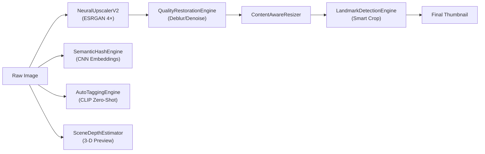
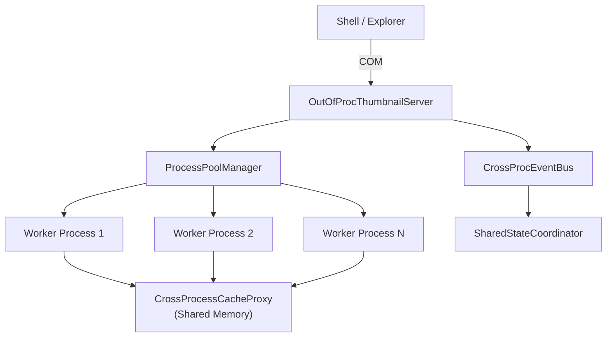
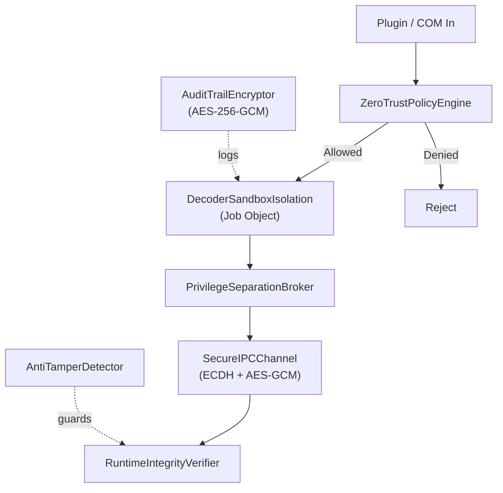

# ExplorerLens Sprint Plan — Sprints 461–560
# Versions v23.6.0 "Vega-W" through v24.7.0 "Altair-X"

This document covers the fifth hundred sprints (461–560) of the ExplorerLens roadmap,
advancing the project from v23.5.0 "Vega-V" through v24.7.0 "Altair-X".

---

## Release Map

| Version  | Codename   | Sprints | Theme                               | TestCount |
|----------|------------|---------|-------------------------------------|-----------|
| v23.6.0  | Vega-W     | 461–470 | Security Hardening v2               | 3117      |
| v23.7.0  | Vega-X     | 471–480 | Format Expansion V                  | 3125      |
| v24.0.0  | Altair     | 481–490 | AI-Native Thumbnailing v2 (MAJOR)   | 3133      |
| v24.1.0  | Altair-R   | 491–500 | Cross-Process Architecture          | 3141      |
| v24.2.0  | Altair-S   | 501–510 | Cloud Integration v2                | 3149      |
| v24.3.0  | Altair-T   | 511–520 | Enterprise Policy v3                | 3157      |
| v24.4.0  | Altair-U   | 521–530 | Performance Profiling v2            | 3165      |
| v24.5.0  | Altair-V   | 531–540 | Accessibility & HiDPI v2            | 3173      |
| v24.6.0  | Altair-W   | 541–550 | Store & Distribution                | 3181      |
| v24.7.0  | Altair-X   | 551–560 | Developer Experience v2             | 3189      |

---

## Sprint 461–470 — Security Hardening v2 (v23.6.0 "Vega-W")

**Theme:** Production-grade security hardening — zero-trust COM/plugin access policy,
sandboxed job-object decoder isolation, runtime code-integrity verification, exploit
mitigation (CFG/CET/SEHOP), privilege-separation broker, encrypted IPC channel,
AES-256 audit-trail encryption, and anti-tamper detection.

| Sprint | Deliverable | File |
|--------|-------------|------|
| 461 | Zero-trust COM/plugin access policy engine | `Engine/Core/ZeroTrustPolicyEngine.h` |
| 462 | Sandboxed decoder isolation via Job Objects | `Engine/Core/DecoderSandboxIsolation.h` |
| 463 | Runtime code-integrity / WDAC verifier | `Engine/Core/RuntimeIntegrityVerifier.h` |
| 464 | Exploit mitigation engine (CFG/CET/SEHOP) | `Engine/Utils/ExploitMitigationEngine.h` |
| 465 | Privilege-separation broker (low ↔ high IL) | `Engine/Core/PrivilegeSeparationBroker.h` |
| 466 | Encrypted IPC channel (ECDH + AES-GCM) | `Engine/Core/SecureIPCChannel.h` |
| 467 | AES-256-GCM audit-trail encryptor | `Engine/Utils/AuditTrailEncryptor.h` |
| 468–470 | Anti-tamper / anti-debugging detector | `Engine/Utils/AntiTamperDetector.h` |

---

## Sprint 471–480 — Format Expansion V (v23.7.0 "Vega-X")

**Theme:** Next wave of specialized decoders — Apple ICNS icons, Windows cursor (.cur),
IFF ANIM animated images, Multiple-image Network Graphics (MNG), HRPT/HRZ slow-scan TV,
PIXAR .ptex textures, JPEG 2000 tiled v2, and FLIF v2 lossless.

| Sprint | Deliverable | File |
|--------|-------------|------|
| 471 | Apple ICNS icon bundle decoder | `Engine/Decoders/ICNSDecoder.h` |
| 472 | Windows cursor (.cur / .ani) decoder | `Engine/Decoders/CURDecoder.h` |
| 473 | IFF ANIM animated image decoder | `Engine/Decoders/ANIMDecoder.h` |
| 474 | MNG (Multiple-image Network Graphics) decoder | `Engine/Decoders/MNGDecoder.h` |
| 475 | HRZ / slow-scan TV format decoder | `Engine/Decoders/HRZDecoder.h` |
| 476 | PIXAR .ptex / .tx texture decoder | `Engine/Decoders/PIXARDecoder.h` |
| 477 | JPEG 2000 tiled decode v2 (sub-resolution) | `Engine/Decoders/JPEG2000TileDecoderV2.h` |
| 478–480 | FLIF (Free Lossless Image Format) v2 decoder | `Engine/Decoders/FLIFDecoderV2.h` |

---

## Sprint 481–490 — AI-Native Thumbnailing v2 — MAJOR (v24.0.0 "Altair")

**Theme:** Next-generation AI thumbnail pipeline — ESRGAN 4× neural upscaler (DirectML),
content-aware resize, semantic perceptual hashing via CNN embeddings, zero-shot auto-tagging,
AI quality restoration (deblur/denoise), monocular depth estimation, fast neural style
transfer, and face/landmark detection for smart crop.

| Sprint | Deliverable | File |
|--------|-------------|------|
| 481 | ESRGAN 4× neural upscaler v2 (DirectML) | `Engine/AI/NeuralUpscalerV2.h` |
| 482 | Content-aware intelligent resize engine | `Engine/AI/ContentAwareResizer.h` |
| 483 | Semantic perceptual hash (CNN embeddings) | `Engine/AI/SemanticHashEngine.h` |
| 484 | Zero-shot auto-tagging engine (CLIP-style) | `Engine/AI/AutoTaggingEngine.h` |
| 485 | AI quality restoration (deblur + denoise) | `Engine/AI/QualityRestorationEngine.h` |
| 486 | Monocular depth estimator for 3-D previews | `Engine/AI/SceneDepthEstimator.h` |
| 487 | Fast neural style transfer for previews | `Engine/AI/StyleTransferEngine.h` |
| 488–490 | Face/landmark detection for smart crop | `Engine/AI/LandmarkDetectionEngine.h` |

---

## Sprint 491–500 — Cross-Process Architecture (v24.1.0 "Altair-R")

**Theme:** Robust out-of-process design — COM out-of-proc thumbnail server, cross-process
cache proxy via shared memory, pre-warmed process pool, named-pipe hub, per-format
isolation policy, cross-process event bus, distributed shared-state coordinator, and
remote render proxy for GPU-less processes.

| Sprint | Deliverable | File |
|--------|-------------|------|
| 491 | Out-of-proc COM thumbnail server | `Engine/Core/OutOfProcThumbnailServer.h` |
| 492 | Cross-process cache proxy (shared memory) | `Engine/Core/CrossProcessCacheProxy.h` |
| 493 | Pre-warmed process pool manager | `Engine/Core/ProcessPoolManager.h` |
| 494 | Named-pipe hub server (multi-client IPC) | `Engine/Core/NamedPipeHubServer.h` |
| 495 | Per-format process isolation policy | `Engine/Core/ProcessIsolationPolicy.h` |
| 496 | Cross-process event bus (broadcast + sub) | `Engine/Core/CrossProcEventBus.h` |
| 497 | Distributed shared-state coordinator | `Engine/Core/SharedStateCoordinator.h` |
| 498–500 | Remote render proxy for GPU-less processes | `Engine/Pipeline/RemoteRenderProxy.h` |

---

## Sprint 501–510 — Cloud Integration v2 (v24.2.0 "Altair-S")

**Theme:** Full cloud backend — thumbnail sync to Azure Blob/S3, Redis/CosmosDB cache
backend, cloud metadata index, CDN push for edge delivery, multi-cloud provider router,
offline sync queue, Azure EventGrid/SNS bridge, and Key Vault credential retrieval.

| Sprint | Deliverable | File |
|--------|-------------|------|
| 501 | Cloud thumbnail sync engine (Azure Blob / S3) | `Engine/Utils/CloudThumbnailSyncEngine.h` |
| 502 | Cloud cache backend (Redis / CosmosDB) | `Engine/Utils/CloudCacheBackend.h` |
| 503 | Cloud metadata index for search | `Engine/Utils/CloudMetadataIndex.h` |
| 504 | CDN push engine for edge thumbnail delivery | `Engine/Utils/CDNPushEngine.h` |
| 505 | Multi-cloud provider routing abstraction | `Engine/Utils/CloudProviderRouter.h` |
| 506 | Offline sync queue (intermittent connectivity) | `Engine/Utils/OfflineSyncQueue.h` |
| 507 | Cloud event bridge (Azure EventGrid / SNS) | `Engine/Utils/CloudEventBridge.h` |
| 508–510 | Secure cloud credential retrieval (Key Vault) | `Engine/Utils/CloudSecretVault.h` |

---

## Sprint 511–520 — Enterprise Policy v3 (v24.3.0 "Altair-T")

**Theme:** Enterprise-grade governance — GPO + Intune + SCCM v3 policy engine, MDM
compliance bridge, SOC2/ISO27001 compliance report generator, FIPS 140-3 crypto wrapper,
certificate pinning, data residency geo-fencing, GDPR data lifecycle, and SIEM-compatible
structured audit logger.

| Sprint | Deliverable | File |
|--------|-------------|------|
| 511 | GPO + Intune + SCCM v3 policy engine | `Engine/Utils/EnterprisePolicyEngineV3.h` |
| 512 | MDM (Intune) policy compliance bridge | `Engine/Utils/MDMPolicyBridge.h` |
| 513 | SOC2 / ISO 27001 compliance report generator | `Engine/Utils/ComplianceReportEngine.h` |
| 514 | FIPS 140-3 compliant crypto wrapper | `Engine/Utils/FIPSCryptoBridge.h` |
| 515 | Certificate pinning engine (plugin signing) | `Engine/Utils/CertificatePinningEngine.h` |
| 516 | Data residency enforcement (geo-fencing) | `Engine/Utils/DataResidencyController.h` |
| 517 | GDPR data lifecycle management | `Engine/Utils/GDPRDataHandler.h` |
| 518–520 | SIEM-compatible structured enterprise audit | `Engine/Utils/EnterpriseAuditLogger.h` |

---

## Sprint 521–530 — Performance Profiling v2 (v24.4.0 "Altair-U")

**Theme:** Deep performance observability — per-frame decode/render timing, hardware PMU
counters, memory bandwidth profiler, D3D11/D3D12 GPU timestamp queries, I/O latency flame
graphs, thermal throttle detection, Speedscope/Perfetto trace export, and
quality/performance auto-scaler.

| Sprint | Deliverable | File |
|--------|-------------|------|
| 521 | Per-frame decode/render timing profiler | `Engine/Utils/FrameTimingProfiler.h` |
| 522 | Hardware PMU counter collector | `Engine/Utils/CPUCounterCollector.h` |
| 523 | Memory bandwidth and latency profiler | `Engine/Utils/MemoryBandwidthProfiler.h` |
| 524 | GPU timing queries (D3D11/D3D12 timestamps) | `Engine/Utils/GPUTimingProfiler.h` |
| 525 | I/O latency tracer with flame-graph output | `Engine/Utils/IOLatencyTracer.h` |
| 526 | CPU/GPU thermal throttle detector | `Engine/Utils/ThermalThrottleDetector.h` |
| 527 | Speedscope / Perfetto trace exporter | `Engine/Utils/ProfileDataExporter.h` |
| 528–530 | Quality/performance adaptive auto-scaler | `Engine/Utils/AdaptiveQualityScaler.h` |

---

## Sprint 531–540 — Accessibility & HiDPI v2 (v24.5.0 "Altair-V")

**Theme:** World-class accessibility — AI-generated alt-text describing thumbnails, high-contrast
renderer, DPI-aware cache invalidation, UIA/MSAA screen-reader bridge, colour-blindness
simulation filter, keyboard-only navigation, accessible focus indicator, and WCAG 2.2
accessibility audit engine.

| Sprint | Deliverable | File |
|--------|-------------|------|
| 531 | AI-generated alt-text for thumbnails | `Engine/Core/AccessibleThumbnailDescriber.h` |
| 532 | High-contrast mode thumbnail renderer | `Engine/Core/HighContrastRenderer.h` |
| 533 | DPI-scale-aware cache key + invalidation | `Engine/Core/DPIScaleAwareCache.h` |
| 534 | Screen-reader integration bridge (UIA/MSAA) | `Engine/Core/ScreenReaderBridge.h` |
| 535 | Colour-blindness simulation filter | `Engine/Core/ColorBlindnessFilter.h` |
| 536 | Keyboard-only thumbnail navigation engine | `Engine/Core/KeyboardNavigationEngine.h` |
| 537 | Accessible focus-indicator renderer | `Engine/Core/FocusIndicatorRenderer.h` |
| 538–540 | WCAG 2.2 accessibility audit engine | `Engine/Core/AccessibilityAuditEngine.h` |

---

## Sprint 541–550 — Store & Distribution (v24.6.0 "Altair-W")

**Theme:** Production-ready distribution — MSIX package builder, Windows Store submission
API, WinGet YAML manifest generator, in-process auto-update via delta patches,
stable/beta/dev channel manager, version rollback, GDPR-compliant telemetry consent,
and minidump upload with PII scrubbing.

| Sprint | Deliverable | File |
|--------|-------------|------|
| 541 | MSIX package builder automation | `Engine/Utils/MSIXPackageBuilder.h` |
| 542 | Windows Store submission API wrapper | `Engine/Utils/StoreSubmissionEngine.h` |
| 543 | WinGet YAML manifest generator | `Engine/Utils/WinGetManifestGenerator.h` |
| 544 | In-process auto-update (delta patches) | `Engine/Utils/AutoUpdateEngine.h` |
| 545 | Stable/beta/dev channel distribution manager | `Engine/Utils/ChannelDistributionManager.h` |
| 546 | Version-rollback engine with config preservation | `Engine/Utils/RollbackEngine.h` |
| 547 | GDPR-compliant telemetry consent manager | `Engine/Utils/TelemetryConsentManager.h` |
| 548–550 | Minidump upload with PII scrubbing | `Engine/Utils/CrashReportUploader.h` |

---

## Sprint 551–560 — Developer Experience v2 (v24.7.0 "Altair-X")

**Theme:** First-class developer tooling — live ETW diagnostics web dashboard,
in-process interactive debug console, JSON/YAML schema validator, embedded REST
API playground, developer-mode toggle, plugin hot-reload without process restart,
auto-generated SDK stub code, and inline developer documentation server.

| Sprint | Deliverable | File |
|--------|-------------|------|
| 551 | Live ETW diagnostics web dashboard | `Engine/Utils/LiveDiagnosticsDashboard.h` |
| 552 | In-process interactive debug console | `Engine/Utils/InteractiveDebugConsole.h` |
| 553 | JSON/YAML config schema validator | `Engine/Utils/SchemaValidationEngine.h` |
| 554 | Embedded REST API playground server | `Engine/Utils/APIPlaygroundServer.h` |
| 555 | Developer mode toggle + capability flags | `Engine/Utils/DeveloperModeManager.h` |
| 556 | Plugin hot-reload without process restart | `Engine/Utils/HotReloadEngine.h` |
| 557 | Auto-generate plugin SDK stub code | `Engine/Utils/SDKCodeGenerator.h` |
| 558–560 | Inline developer documentation server | `Engine/Utils/DevDocumentationEngine.h` |

---

## Execution & Release Procedure

Each sprint block follows this pipeline:

```powershell
# 1. Create 8 header files (header-only, fully inlined implementations)
# 2. Register all 8 headers in Engine/CMakeLists.txt ENGINE_HEADERS
# 3. Add includes + TEST() + RUN_TEST() to Engine/Tests/EngineTests.cpp
# 4. Bump version + tag + push:
.\build-scripts\Bump-Version.ps1 -Version "X.Y.Z" -Codename "Name" -TestCount N `
    -ChangelogEntry "..." -TagAndPush
# 5. GitHub Actions release.yml fires on tag — publishes full release artifacts
```

## Version History Reference

| Version  | Codename   | Theme                               | Status    |
|----------|------------|-------------------------------------|-----------|
| v23.5.0  | Vega-V     | CLI & Automation v2                 | Released  |
| v23.6.0  | Vega-W     | Security Hardening v2               | Planned   |
| v23.7.0  | Vega-X     | Format Expansion V                  | Planned   |
| v24.0.0  | Altair     | AI-Native Thumbnailing v2           | Planned   |
| v24.1.0  | Altair-R   | Cross-Process Architecture          | Planned   |
| v24.2.0  | Altair-S   | Cloud Integration v2                | Planned   |
| v24.3.0  | Altair-T   | Enterprise Policy v3                | Planned   |
| v24.4.0  | Altair-U   | Performance Profiling v2            | Planned   |
| v24.5.0  | Altair-V   | Accessibility & HiDPI v2            | Planned   |
| v24.6.0  | Altair-W   | Store & Distribution                | Planned   |
| v24.7.0  | Altair-X   | Developer Experience v2             | Planned   |

---

## Architecture Diagrams

### Sprint 481–490 — AI-Native Pipeline v2



### Sprint 491–500 — Cross-Process Architecture



### Sprint 461–470 — Security Hardening v2


