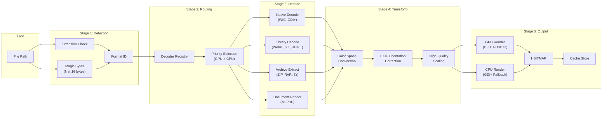
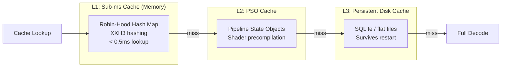

# ExplorerLens — Decode Pipeline

## Pipeline Stages

```mermaid
flowchart LR
    subgraph Input
        File["File Path"]
    end

    subgraph "Stage 1: Detection"
        ExtCheck["Extension Check"]
        MagicBytes["Magic Bytes<br/>(first 16 bytes)"]
        FormatID["Format ID"]
    end

    subgraph "Stage 2: Routing"
        Registry["Decoder Registry"]
        Priority["Priority Selection<br/>(GPU > CPU)"]
    end

    subgraph "Stage 3: Decode"
        Native["Native Decode<br/>(WIC, GDI+)"]
        LibDecode["Library Decode<br/>(WebP, JXL, HEIF...)"]
        Archive["Archive Extract<br/>(ZIP, RAR, 7z)"]
        Document["Document Render<br/>(MuPDF)"]
    end

    subgraph "Stage 4: Transform"
        ColorSpace["Color Space<br/>Conversion"]
        EXIF["EXIF Orientation<br/>Correction"]
        Scale["High-Quality<br/>Scaling"]
    end

    subgraph "Stage 5: Output"
        GPURender["GPU Render<br/>(D3D11/D3D12)"]
        CPURender["CPU Render<br/>(GDI+ Fallback)"]
        Cache["Cache Store"]
        HBITMAP["HBITMAP"]
    end

    File --> ExtCheck
    File --> MagicBytes
    ExtCheck --> FormatID
    MagicBytes --> FormatID
    FormatID --> Registry
    Registry --> Priority
    Priority --> Native
    Priority --> LibDecode
    Priority --> Archive
    Priority --> Document
    Native --> ColorSpace
    LibDecode --> ColorSpace
    Archive --> ColorSpace
    Document --> ColorSpace
    ColorSpace --> EXIF
    EXIF --> Scale
    Scale --> GPURender
    Scale --> CPURender
    GPURender --> HBITMAP
    CPURender --> HBITMAP
    HBITMAP --> Cache
```

## Format Decoder Routing

```mermaid
graph TD
    Input["Detected Format"]

    Input -->|"JPEG/PNG/BMP/TIFF"| WIC["WIC Decoder<br/>(Windows built-in)"]
    Input -->|"WebP"| WebP["libwebp 1.5.0"]
    Input -->|"JXL"| JXL["libjxl 0.11.1"]
    Input -->|"HEIF/HEIC"| HEIF["libheif 1.19.5<br/>+ libde265"]
    Input -->|"AVIF"| AVIF["libavif 1.3.0<br/>+ dav1d"]
    Input -->|"RAW (CR2/NEF/ARW...)"| RAW["LibRaw 0.21.3"]
    Input -->|"PDF"| PDF["MuPDF 1.24.11"]
    Input -->|"ZIP/CBZ/EPUB"| ZIP["minizip-ng 4.0.10"]
    Input -->|"RAR/CBR"| RAR["UnRAR 7.2.2"]
    Input -->|"7z/CB7"| LZMA["LZMA SDK 26.00"]
    Input -->|"SVG"| SVG["SVG Decoder<br/>(Direct2D)"]
    Input -->|"DDS/KTX/VTF"| GPU["GPU Texture<br/>Decoder"]
    Input -->|"EXR/HDR"| HDR["HDR Pipeline<br/>+ Tone Mapping"]
    Input -->|"PSD/XCF"| Layer["Layer Compositor"]
    Input -->|"MP4/MKV/AVI"| Video["Video Decoder<br/>(Media Foundation)"]
    Input -->|"FITS/DICOM/NIfTI"| Sci["Scientific<br/>Decoder"]
    Input -->|"glTF/USD/OBJ"| Model["3D Model<br/>Renderer"]
    Input -->|"TTF/OTF/WOFF"| Font["Font Preview<br/>Decoder"]
```

## Cache Strategy

```mermaid
graph LR
    subgraph "L1: Sub-ms Cache (Memory)"
        RobinHood["Robin-Hood Hash Map<br/>XXH3 hashing<br/>&lt; 0.5ms lookup"]
    end

    subgraph "L2: PSO Cache"
        PSOCache["Pipeline State Objects<br/>Shader precompilation"]
    end

    subgraph "L3: Persistent Disk Cache"
        DiskCache["SQLite / flat files<br/>Survives restart"]
    end

    Request["Cache Lookup"] --> RobinHood
    RobinHood -->|"miss"| PSOCache
    PSOCache -->|"miss"| DiskCache
    DiskCache -->|"miss"| Decode["Full Decode"]
```
