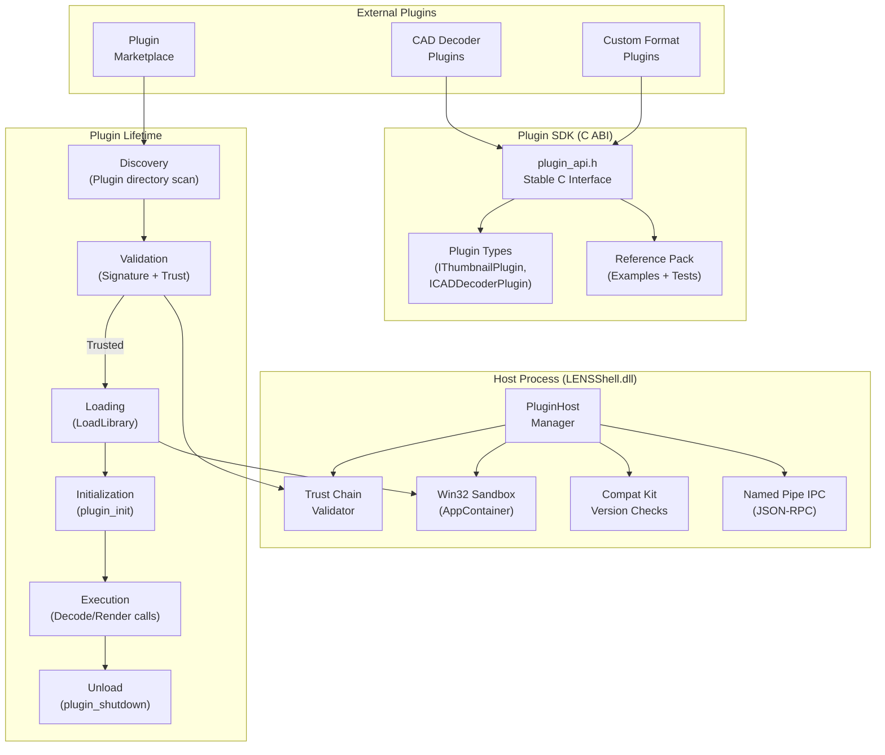
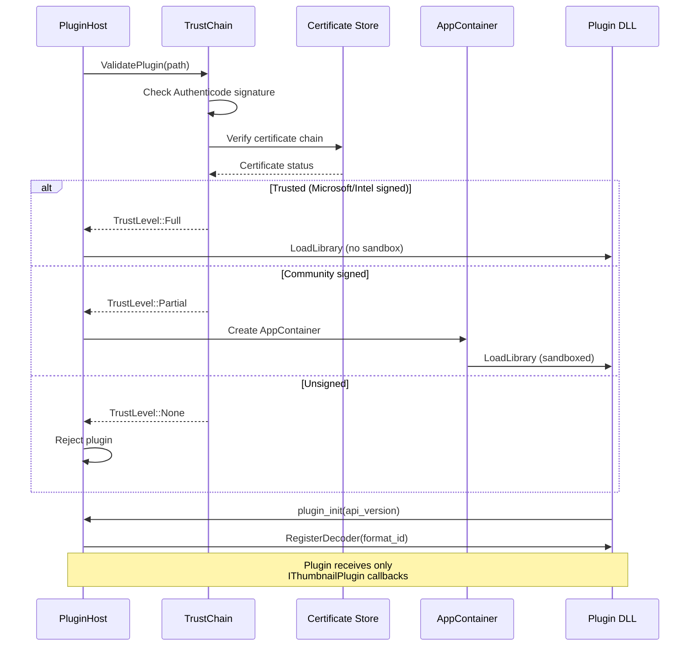
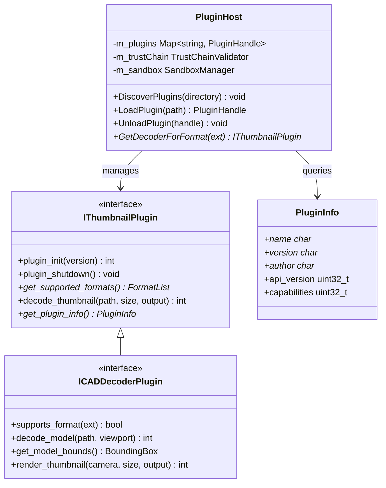

# ExplorerLens — Plugin Architecture

## Plugin Ecosystem Overview

```mermaid
graph TB
    subgraph "Host Process (LENSShell.dll)"
        PluginHost["PluginHost<br/>Manager"]
        TrustChain["Trust Chain<br/>Validator"]
        Sandbox["Win32 Sandbox<br/>(AppContainer)"]
        CompatKit["Compat Kit<br/>Version Checks"]
        IPC["Named Pipe IPC<br/>(JSON-RPC)"]
    end

    subgraph "Plugin SDK (C ABI)"
        API["plugin_api.h<br/>Stable C Interface"]
        Types["Plugin Types<br/>(IThumbnailPlugin,<br/>ICADDecoderPlugin)"]
        RefPack["Reference Pack<br/>(Examples + Tests)"]
    end

    subgraph "Plugin Lifetime"
        Discovery["Discovery<br/>(Plugin directory scan)"]
        Validation["Validation<br/>(Signature + Trust)"]
        Loading["Loading<br/>(LoadLibrary)"]
        Init["Initialization<br/>(plugin_init)"]
        Execute["Execution<br/>(Decode/Render calls)"]
        Unload["Unload<br/>(plugin_shutdown)"]
    end

    subgraph "External Plugins"
        CAD["CAD Decoder<br/>Plugins"]
        Custom["Custom Format<br/>Plugins"]
        Marketplace["Plugin<br/>Marketplace"]
    end

    PluginHost --> TrustChain
    PluginHost --> Sandbox
    PluginHost --> CompatKit
    PluginHost --> IPC

    API --> Types
    API --> RefPack

    Discovery --> Validation
    Validation --> TrustChain
    Validation -->|"Trusted"| Loading
    Loading --> Sandbox
    Loading --> Init
    Init --> Execute
    Execute --> Unload

    Marketplace --> Discovery
    CAD --> API
    Custom --> API
```

## Plugin Trust Chain

```mermaid
sequenceDiagram
    participant Host as PluginHost
    participant Trust as TrustChain
    participant Cert as Certificate Store
    participant Sandbox as AppContainer
    participant Plugin as Plugin DLL

    Host->>Trust: ValidatePlugin(path)
    Trust->>Trust: Check Authenticode signature
    Trust->>Cert: Verify certificate chain
    Cert-->>Trust: Certificate status

    alt Trusted (Microsoft/Intel signed)
        Trust-->>Host: TrustLevel::Full
        Host->>Plugin: LoadLibrary (no sandbox)
    else Community signed
        Trust-->>Host: TrustLevel::Partial
        Host->>Sandbox: Create AppContainer
        Sandbox->>Plugin: LoadLibrary (sandboxed)
    else Unsigned
        Trust-->>Host: TrustLevel::None
        Host->>Host: Reject plugin
    end

    Plugin->>Host: plugin_init(api_version)
    Host->>Plugin: RegisterDecoder(format_id)
    
    Note over Host,Plugin: Plugin receives only<br/>IThumbnailPlugin callbacks
```

## Plugin API Surface

```mermaid
classDiagram
    class IThumbnailPlugin {
        <<interface>>
        +plugin_init(version) int
        +plugin_shutdown() void
        +get_supported_formats() FormatList*
        +decode_thumbnail(path, size, output) int
        +get_plugin_info() PluginInfo*
    }

    class ICADDecoderPlugin {
        <<interface>>
        +supports_format(ext) bool
        +decode_model(path, viewport) int
        +get_model_bounds() BoundingBox
        +render_thumbnail(camera, size, output) int
    }

    class PluginHost {
        +DiscoverPlugins(directory) void
        +LoadPlugin(path) PluginHandle
        +UnloadPlugin(handle) void
        +GetDecoderForFormat(ext) IThumbnailPlugin*
        -m_plugins Map~string, PluginHandle~
        -m_trustChain TrustChainValidator
        -m_sandbox SandboxManager
    }

    class PluginInfo {
        +name char*
        +version char*
        +author char*
        +api_version uint32_t
        +capabilities uint32_t
    }

    IThumbnailPlugin <|-- ICADDecoderPlugin
    PluginHost --> IThumbnailPlugin : manages
    PluginHost --> PluginInfo : queries
```
