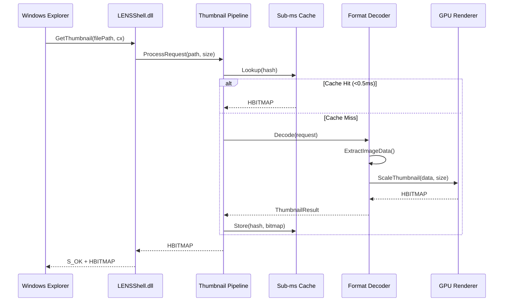

# ExplorerLens — System Overview

## Component Architecture

```mermaid
graph TB
    subgraph "Windows Shell"
        Explorer["Windows Explorer"]
        ContextMenu["Context Menu (IExplorerCommand)"]
    end

    subgraph "LENSShell.dll (COM Shell Extension)"
        IThumbnail["IThumbnailProvider"]
        COMReg["COM Registration<br/>CLSID: 9E6ECB90..."]
    end

    subgraph "ExplorerLensEngine.lib"
        subgraph "Pipeline"
            FormatDetect["Format Detector"]
            DecoderReg["Decoder Registry"]
            Pipeline["Thumbnail Pipeline"]
            BatchProc["Batch Processor"]
        end

        subgraph "Decoders (25+)"
            ImageDec["Image Decoders<br/>JPEG, PNG, WebP, JXL, AVIF, HEIF"]
            ArchiveDec["Archive Decoders<br/>ZIP, RAR, 7z, CBZ/CBR"]
            DocDec["Document Decoders<br/>PDF, EPUB, Office"]
            CADDec["CAD/3D Decoders<br/>glTF, USD, STEP"]
            VideoDec["Video/Audio Decoders<br/>MP4, MKV, FLAC"]
            ScientificDec["Scientific Decoders<br/>FITS, DICOM, NIfTI"]
        end

        subgraph "GPU Pipeline"
            D3D11["D3D11 Renderer"]
            D3D12["D3D12 Compute"]
            Vulkan["Vulkan Compute"]
            GDI["GDI+ Fallback"]
        end

        subgraph "Cache"
            SubMsCache["Sub-ms Cache<br/>(Robin-Hood, XXH3)"]
            DiskCache["Persistent Disk Cache"]
            PSOCache["PSO Cache"]
        end

        subgraph "Memory"
            MemPressure["Memory Pressure<br/>5-tier Controller"]
            BitmapPool["Bitmap Pool"]
            Compactor["Archive Compactor"]
        end
    end

    subgraph "LENSManager.exe (WTL GUI)"
        Registration["Format Registration"]
        Settings["Settings / Configuration"]
        Diagnostics["Diagnostics Dashboard"]
    end

    subgraph "External Libraries"
        zlib["zlib 1.3.1"]
        lz4["LZ4 1.10.0"]
        zstd["zstd 1.5.7"]
        webp["libwebp 1.5.0"]
        jxl["libjxl 0.11.1"]
        heif["libheif 1.19.5"]
        raw["LibRaw 0.21.3"]
        avif["libavif 1.3.0"]
        mupdf["MuPDF 1.24.11"]
    end

    Explorer -->|"GetThumbnail()"| IThumbnail
    Explorer -->|"Win11 Menu"| ContextMenu
    IThumbnail --> Pipeline
    Pipeline --> FormatDetect
    FormatDetect --> DecoderReg
    DecoderReg --> ImageDec
    DecoderReg --> ArchiveDec
    DecoderReg --> DocDec
    DecoderReg --> CADDec
    DecoderReg --> VideoDec
    DecoderReg --> ScientificDec

    ImageDec --> D3D11
    ImageDec --> SubMsCache
    Pipeline --> BatchProc

    ImageDec -.->|"decode"| webp
    ImageDec -.->|"decode"| jxl
    ImageDec -.->|"decode"| heif
    ImageDec -.->|"decode"| avif
    ImageDec -.->|"decode"| raw
    ArchiveDec -.->|"extract"| zlib
    ArchiveDec -.->|"extract"| lz4
    ArchiveDec -.->|"extract"| zstd
    DocDec -.->|"render"| mupdf

    LENSManager.exe --> Registration
    LENSManager.exe --> Settings
    LENSManager.exe --> Diagnostics
```

## Data Flow


