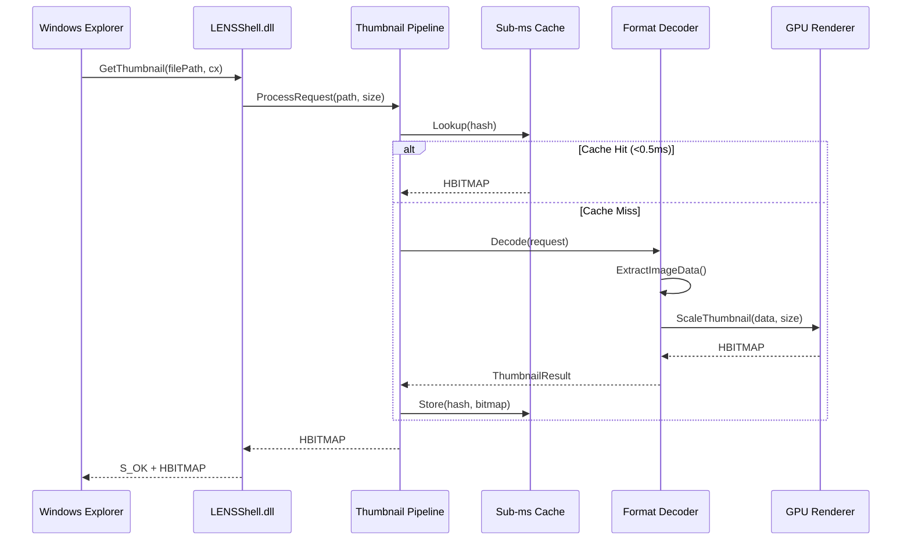
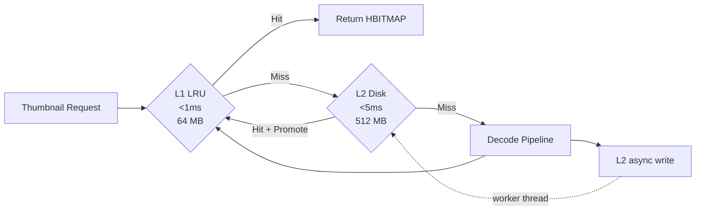

# ExplorerLens — System Overview

## Component Architecture

```mermaid
graph TB
    subgraph "Windows Shell"
        Explorer["Windows Explorer"]
        ContextMenu["Context Menu (IExplorerCommand)"]
    end

    subgraph "LENSShell.dll (COM Shell Extension)"
        IThumbnail["IThumbnailProvider"]
        COMReg["COM Registration<br/>CLSID: 9E6ECB90..."]
    end

    subgraph "ExplorerLensEngine.lib"
        subgraph "Pipeline"
            FormatDetect["Format Detector"]
            DecoderReg["Decoder Registry"]
            Pipeline["Thumbnail Pipeline"]
            BatchProc["Batch Processor"]
        end

        subgraph "Decoders (25+)"
            ImageDec["Image Decoders<br/>JPEG, PNG, WebP, JXL, AVIF, HEIF"]
            ArchiveDec["Archive Decoders<br/>ZIP, RAR, 7z, CBZ/CBR"]
            DocDec["Document Decoders<br/>PDF, EPUB, Office"]
            CADDec["CAD/3D Decoders<br/>glTF, USD, STEP"]
            VideoDec["Video/Audio Decoders<br/>MP4, MKV, FLAC"]
            ScientificDec["Scientific Decoders<br/>FITS, DICOM, NIfTI"]
        end

        subgraph "GPU Pipeline"
            D3D11["D3D11 Renderer"]
            D3D12["D3D12 Compute"]
            Vulkan["Vulkan Compute"]
            GDI["GDI+ Fallback"]
        end

        subgraph "Cache"
            SubMsCache["Sub-ms Cache<br/>(Robin-Hood, XXH3)"]
            DiskCache["Persistent Disk Cache"]
            PSOCache["PSO Cache"]
        end

        subgraph "Memory"
            MemPressure["Memory Pressure<br/>5-tier Controller"]
            BitmapPool["Bitmap Pool"]
            Compactor["Archive Compactor"]
        end
    end

    subgraph "LENSManager.exe (WTL GUI)"
        Registration["Format Registration"]
        Settings["Settings / Configuration"]
        Diagnostics["Diagnostics Dashboard"]
    end

    subgraph "External Libraries"
        zlib["zlib 1.3.1"]
        lz4["LZ4 1.10.0"]
        zstd["zstd 1.5.7"]
        webp["libwebp 1.5.0"]
        jxl["libjxl 0.11.1"]
        heif["libheif 1.19.5"]
        raw["LibRaw 0.21.3"]
        avif["libavif 1.3.0"]
        mupdf["MuPDF 1.24.11"]
    end

    Explorer -->|"GetThumbnail()"| IThumbnail
    Explorer -->|"Win11 Menu"| ContextMenu
    IThumbnail --> Pipeline
    Pipeline --> FormatDetect
    FormatDetect --> DecoderReg
    DecoderReg --> ImageDec
    DecoderReg --> ArchiveDec
    DecoderReg --> DocDec
    DecoderReg --> CADDec
    DecoderReg --> VideoDec
    DecoderReg --> ScientificDec

    ImageDec --> D3D11
    ImageDec --> SubMsCache
    Pipeline --> BatchProc

    ImageDec -.->|"decode"| webp
    ImageDec -.->|"decode"| jxl
    ImageDec -.->|"decode"| heif
    ImageDec -.->|"decode"| avif
    ImageDec -.->|"decode"| raw
    ArchiveDec -.->|"extract"| zlib
    ArchiveDec -.->|"extract"| lz4
    ArchiveDec -.->|"extract"| zstd
    DocDec -.->|"render"| mupdf

    LENSManager.exe --> Registration
    LENSManager.exe --> Settings
    LENSManager.exe --> Diagnostics
```

## Data Flow



---

## Two-Tier Cache Architecture (v35.5+)



`TwoTierCacheManager` coordinates the two tiers:
- **L1** — `SubMillisecondCacheEngine` (XXH3-keyed robin-hood LRU, in-process)
- **L2** — `DiskCacheStore` (FNV-1a keyed flat-file blobs under `%LOCALAPPDATA%\ExplorerLens\Cache`)
- **Invalidation** — `CacheInvalidationWatcher` (ReadDirectoryChangesW) fires prefix invalidation on file changes

---

## GPU Shader Pipeline (v35.5+)

New HLSL compute shaders in `Engine/GPU/shaders/`:

| Shader | Purpose |
|--------|---------|
| `resize_bilinear.hlsl` | Fast bilinear downscale for thumbnail generation |
| `resize_lanczos.hlsl` | High-quality Lanczos-3 resize for preview pane |
| `tonemap_pq_to_srgb.hlsl` | HDR10 PQ → sRGB for HEIF/AVIF HDR content |
| `tonemap_hlg_to_srgb.hlsl` | HLG → sRGB for BT.2100 video stills |
| `demosaic_bayer.hlsl` | RAW camera Bayer pattern → RGB |
| `colorspace_yuv_to_rgb.hlsl` | YCbCr BT.601/709/2020 → RGB |

---

## New Components (v35.5)

| Component | Location | Purpose |
|-----------|----------|---------|
| `EmbeddedPreviewExtractor` | `Engine/Core/` | LibRaw `unpack_thumb()` fast path for RAW thumbnails |
| `ArchiveCoverExtractor` | `Engine/Core/` | First-image extraction from ZIP/CBZ/RAR via libarchive |
| `ExifOrientationNormalizer` | `Engine/Core/` | In-place BGRA pixel rotation for EXIF tags 1–8 |
| `ThumbnailSizeGrid` | `Engine/Core/` | Canonical size presets + grid layout for thumbnail strips |
| `ErrorCategorizationEngine` | `Engine/Core/` | HRESULT/errno → `DecodeErrorCategory` mapping |
| `DecoderPerformanceCounters` | `Engine/Core/` | Lock-free per-format latency histograms (P50/P95/P99) |
| `TwoTierCacheManager` | `Engine/Cache/` | L1 LRU + L2 persistent disk cache coordination |
| `DiskCacheStore` | `Engine/Cache/` | SHA-keyed flat-file thumbnail blob store |
| `CacheInvalidationWatcher` | `Engine/Cache/` | ReadDirectoryChangesW → cache invalidation |
